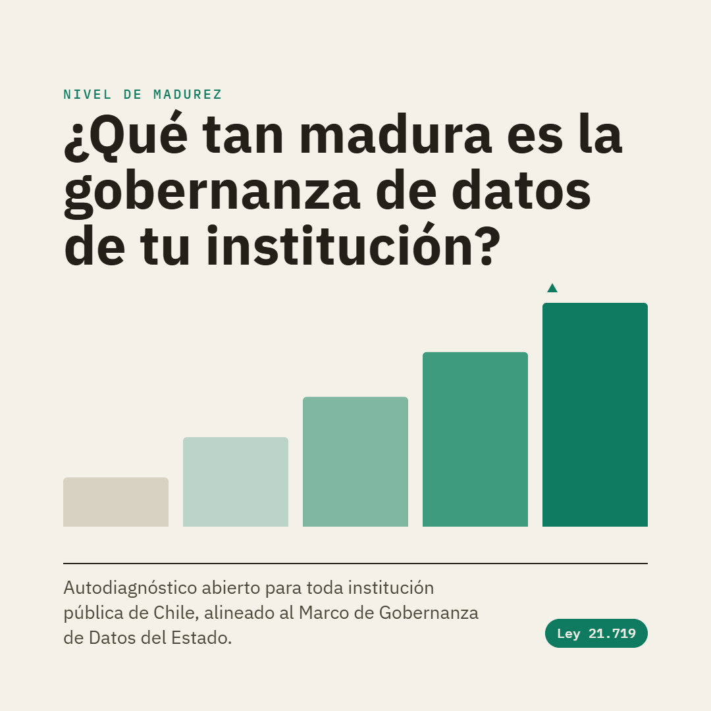

# Autoevaluación de madurez — Ley 21.719 + Gobernanza de datos

<p align="center">
  
</p>

<p align="center">
  🌐 <b>App en vivo:</b> <a href="https://paulovillarroel.github.io/levantamiento-gobierno-datos/">https://paulovillarroel.github.io/levantamiento-gobierno-datos/</a>
</p>

Herramienta web de **autodiagnóstico de madurez** para estimar qué tan preparada está una institución pública frente a la **nueva Ley de Protección de Datos Personales (Ley 21.719, vigente 1-dic-2026)** y frente al **estado del arte en gobernanza de datos** (alineado al **MGDE — Marco de Gestión de Datos del Estado**).

Es un **formulario tipo Likert** simple, en lenguaje claro, con **escala de madurez 1–5**. Entrega puntajes por dimensión, un panel con gráficos radar y un **plan de acción por dimensión**: cada dimensión trae una escalera de acciones por nivel (→2/→3/→4/→5, estilo playbook BID) y el reporte muestra la acción concreta para subir al siguiente nivel — para todas las dimensiones, no solo las brechas.

El levantamiento se organiza **por sesiones**: cada reunión con un área/departamento de la institución es una sesión independiente (con sus participantes y avance propios), y la vista **Consolidado** combina todas las sesiones —locales o importadas como JSON— en una matriz dimensión × área con promedios institucionales, brechas transversales y cobertura del levantamiento (qué áreas faltan). Ver [`docs/decisiones/003-levantamiento-por-sesiones-y-consolidado.md`](docs/decisiones/003-levantamiento-por-sesiones-y-consolidado.md).

> 🔒 **Privacidad.** Funciona por completo en el navegador. **Ninguna respuesta se envía a internet ni a ningún servidor.** El avance se guarda solo en el equipo (localStorage) y el usuario decide si lo exporta como archivo JSON/CSV. El consolidado también se calcula localmente.

---

## Contenido

- **Módulo A — Ley 21.719** (14 dimensiones): gobernanza/DPO, base de licitud, RAT, datos sensibles, consentimiento, derechos ARCOP, EIPD, seguridad, brechas, encargados, transferencias, anonimización, cultura y cesiones entre organismos.
- **Módulo B — Gobernanza de datos / MGDE** (12 dimensiones): instancias de gobernanza, roles, estrategia/activos estratégicos, políticas/datos abiertos, calidad, metadatos, arquitectura/interoperabilidad semántica, seguridad, ciclo de vida/gestión documental, cultura/uso de datos, adopción efectiva y gobierno de modelos analíticos e IA (incl. IA generativa).
- **Módulo C — Sector salud** (opcional, 3 dimensiones): régimen reforzado del dato de salud, ficha clínica e interoperabilidad clínica. Se activa solo si la institución marca que pertenece al sector salud.
- **69 preguntas** base (+ 8 opcionales del Módulo C salud = **77** si se activa). 45–60 min en reunión de levantamiento por área; 15–20 min si se responde individualmente. Escala 1–5 con equivalencia a los 4 niveles del MGDE + opción "No sé / N/A".

El banco de preguntas está documentado en [`docs/banco-preguntas.md`](docs/banco-preguntas.md) y es el espejo legible del código en `src/data/banco.ts`.

---

## Grupos de preguntas del formulario

Las **69 preguntas** base se organizan en **26 dimensiones** (grupos temáticos), en dos módulos; un **Módulo C opcional** de 8 preguntas se suma para instituciones de salud (**77** en total si se activa). Cada afirmación se responde en la **escala de madurez 1–5** (o "No sé / N/A"). Las dimensiones marcadas **crítica** pesan ×1.5 en el puntaje del módulo (deberes legales basales o criticidad de gobernanza) y son las que deberían alcanzar al menos el nivel 3 «Definido» antes del 1-dic-2026. El detalle de cada pregunta —con sus notas jurídicas (⚠️) y las acciones por nivel— está en [`docs/banco-preguntas.md`](docs/banco-preguntas.md); la versión imprimible de solo preguntas, en [`docs/cuestionario.md`](docs/cuestionario.md).

### Módulo A — Ley 21.719 · 14 dimensiones · 37 preguntas (7 críticas)

| Dim | Grupo de preguntas | Preg. | |
|---|---|:-:|---|
| A1 | Gobernanza y responsabilidad proactiva *(accountability, DPO)* | 3 | |
| A2 | Base de licitud (órgano público) | 3 | **crítica** |
| A3 | Inventario de datos y Catálogo/RAT | 3 | **crítica** |
| A4 | Datos sensibles | 3 | **crítica** |
| A5 | Consentimiento, información y transparencia | 3 | |
| A6 | Derechos de los titulares (ARCOP + bloqueo/portabilidad) | 3 | **crítica** |
| A7 | Evaluación de Impacto (EIPD/DPIA) | 2 | **crítica** |
| A8 | Seguridad y protección desde el diseño/por defecto | 4 | **crítica** |
| A9 | Gestión de brechas de seguridad | 3 | **crítica** |
| A10 | Encargados (procesadores) y terceros | 2 | |
| A11 | Transferencias internacionales de datos | 2 | |
| A12 | Anonimización / seudonimización | 2 | |
| A13 | Cultura, capacitación y mejora continua | 2 | |
| A14 | Cesiones y compartición con otros organismos | 2 | |

### Módulo B — Gobernanza de datos / MGDE · 12 dimensiones · 32 preguntas (3 críticas)

| Dim | Grupo de preguntas | Preg. | |
|---|---|:-:|---|
| B1 | Instancias y estructura de gobernanza | 3 | **crítica** |
| B2 | Roles y responsabilidades sobre los datos | 2 | **crítica** |
| B3 | Estrategia, visión y recursos | 3 | |
| B4 | Políticas, estándares y cumplimiento normativo *(incl. datos abiertos)* | 3 | |
| B5 | Calidad de datos | 2 | |
| B6 | Metadatos, catálogo y linaje | 2 | |
| B7 | Arquitectura, interoperabilidad e integración | 4 | **crítica** |
| B8 | Seguridad y control de acceso (gobernanza) | 2 | |
| B9 | Ciclo de vida del dato y gestión documental | 2 | |
| B10 | Cultura, alfabetización y gestión del cambio *(incl. uso de datos)* | 3 | |
| B11 | Adopción y cumplimiento efectivo | 2 | |
| B12 | Gobierno de modelos analíticos e IA *(incl. IA generativa)* | 4 | |

> La correspondencia con las **12 dimensiones oficiales del MGDE** y el criterio de criticidad están en [`docs/banco-preguntas.md`](docs/banco-preguntas.md).

### Módulo C — Sector salud · opcional · 3 dimensiones · 8 preguntas

La salud es un **espacio especial de legislación**: al régimen general de la Ley 21.719 se suman deberes propios —el tratamiento reforzado del dato de salud y del perfil biológico (**art. 16 bis**), la **ficha clínica** (Ley 20.584 y Reglamento sobre Fichas Clínicas, Decreto 41/2012) y la **interoperabilidad clínica**—. Por eso, quien marca **"🏥 Esta institución pertenece al sector salud"** en la portada activa este módulo sectorial adicional; el resto de las instituciones no lo ve ni lo puntúa. Al activarlo, el reporte, el consolidado y la base de datos lo incorporan automáticamente.

| Dim | Grupo de preguntas | Preg. | |
|---|---|:-:|---|
| C1 | Datos de salud y régimen reforzado (art. 16 bis) | 3 | **crítica** |
| C2 | Ficha clínica y derechos del paciente (Ley 20.584) | 2 | |
| C3 | Interoperabilidad clínica y datos de salud a gran escala | 3 | |

---

## Stack

- **[Astro](https://astro.build) 5** — sitio estático, build y dev server.
- **React 19** (isla `client:only`) para la parte interactiva (cuestionario + resultados).
- **TypeScript** en modo estricto para el modelo de datos y la lógica de puntaje.
- **Cero dependencias de UI extra**: los gráficos radar se dibujan a mano en SVG.

## Requisitos

- Node.js ≥ 20 (probado con Node 24) y npm.

## Uso

```bash
npm install       # instalar dependencias
npm run dev       # servidor de desarrollo (http://localhost:4321)
npm run build     # compila a dist/ (sitio estático)
npm run preview   # sirve dist/ para revisar el build
npm run check     # typecheck con astro check
```

Para **distribuir**: ejecutar `npm run build` y compartir la carpeta `dist/` (se puede abrir con un servidor estático o publicar en cualquier hosting de archivos estáticos). Los datos siguen quedando solo en el navegador de cada persona.

## Cómo se responde

- El cuestionario avanza **por bloques temáticos** (una dimensión a la vez), con un navegador de chips que muestra el avance por bloque (completo / parcial / pendiente) y permite saltar entre ellos.
- **Cada respuesta se guarda automáticamente** (indicador "✓ guardado HH:MM" en la barra): se puede pausar y retomar en varios momentos; al volver, el cuestionario continúa en el primer bloque pendiente.

## Base de datos local (SQLite) — opcional

El formulario funciona **por sí solo** en el navegador, pero levantar el servidor de sesiones agrega una capa de **consolidación y respaldo** que marca la diferencia cuando el levantamiento involucra a varias áreas. La comparación:

| | Solo el formulario (navegador) | + Servidor de sesiones (SQLite) |
|---|---|---|
| Dónde viven las respuestas | En el navegador de cada persona (localStorage) | Centralizadas en una base única, en el equipo del facilitador |
| Juntar varias áreas | Manual: exportar un JSON por área e importarlos uno a uno | **Automático**: la app sincroniza sola (indicador "● BD conectada") |
| Si se limpia el navegador o se cambia de equipo | Se pierde ese avance | Persiste en la base |
| Consolidado institucional | Hay que reunir antes todos los JSON | Siempre al día con todas las sesiones |
| Respaldo y análisis | — | La base se puede copiar, versionar y analizar |

**Ventajas concretas de levantar el servidor:**

- **Consolidación sin fricción:** varias áreas responden y todo llega a una sola base; no hay que andar enviando y juntando archivos JSON por correo.
- **Respaldo real:** el avance no depende del navegador de cada quien — sobrevive a limpiezas de caché, cambios de equipo o cierres de sesión.
- **Snapshots y evolución en el tiempo:** al ser un archivo `.sqlite`, puedes guardar copias fechadas y **comparar mediciones** entre sí (el skill de análisis acepta `--bd copia.sqlite`).
- **Insumo directo para el informe de consultoría:** el skill `/analizar-resultados` lee la base y produce el diagnóstico con el **mismo puntaje de la app**, sin pasos intermedios.
- **Cero costo de adopción:** sin dependencias nuevas (SQLite viene integrado en Node) y **sin exponer nada a internet** — la base vive solo en el equipo del facilitador.

Para levantarlo (en el equipo de quien facilita el proceso):

```bash
npm run servidor   # servidor local en el puerto 8787; BD en datos/levantamiento.sqlite
```

- La app **detecta sola** el servidor (mismo host, puerto 8787) y sincroniza las sesiones: indicador **"● BD conectada"** en la barra superior. Sin servidor, muestra "○ solo este equipo" y todo funciona igual (localStorage).
- Usa el SQLite **integrado de Node** (`node:sqlite`, Node ≥ 23.4): cero dependencias nuevas.
- La carpeta `datos/` está en `.gitignore`: las respuestas son datos y **nunca van al repo**.
- La **exportación/importación JSON se mantiene** como vía para respuestas individuales aisladas (alguien responde en su equipo, exporta el JSON y el facilitador lo importa; queda en la BD en la siguiente sincronización).
- Conflictos: se resuelven por sesión con "gana la más reciente" (`actualizada`).

## Ejecutar con Docker

**Requisito:** tener **Docker** instalado (Docker Desktop en Windows/macOS, o Docker Engine + plugin Compose en Linux). No hace falta Node ni instalar dependencias. → Guía oficial: https://docs.docker.com/get-docker/

Desde la carpeta del proyecto, levantar el **formulario + el servidor de consolidación (SQLite)** con un solo comando:

```bash
# 1. Obtener el proyecto (cuando esté publicado en GitHub):
git clone https://github.com/paulovillarroel/levantamiento-gobierno-datos.git
cd levantamiento-gobierno-datos

# 2. Construir y levantar todo:
docker compose up --build
```

La primera vez compila las imágenes (unos minutos); las siguientes son casi instantáneas. Para dejarlo corriendo en segundo plano, agregá `-d` (`docker compose up -d --build`).

- Formulario: **http://localhost:8080**
- Servidor de sesiones en el puerto **8787**: la app lo detecta sola (**"● BD conectada"**). Las sesiones quedan en el volumen `datos` (gestionado por Docker; persiste entre reinicios).
- Si el **8080 está ocupado**, cambiá el puerto del formulario: `APP_PORT=9000 docker compose up`. El **8787 debe quedar fijo** (la app busca el servidor ahí).
- Empezar de cero (borrar la BD del volumen): `docker compose down -v`.

**Solo el formulario** (para compartir / opensource, sin base de datos — todo queda en el navegador de cada persona):

```bash
docker build -t levantamiento .
docker run -p 8080:8080 levantamiento
```

> El mismo repo sigue publicándose en **GitHub Pages** sin cambios: el build de Docker usa `BASE_PATH=/` para servir en la raíz, mientras Pages mantiene la base `/levantamiento-gobierno-datos/`.
>
> ⚠️ Pensado para **localhost o red interna por HTTP**. Si se publica por HTTPS, la detección del servidor (usa el mismo protocolo hacia el puerto 8787) requiere exponer también el 8787 por HTTPS o poner un proxy inverso.

---

## Uso en producción y privacidad de los datos

**Usar el instrumento no sube datos al repositorio.** El diseño lo garantiza en tres capas:

1. **Todo vive en el navegador:** las respuestas se guardan en el `localStorage` de cada persona; por responder, nada se envía a internet ni a git.
2. **`datos/` y los export están en `.gitignore`:** la base SQLite (`datos/levantamiento.sqlite`) y los JSON/CSV exportados están excluidos — un `git add -A` normal **no los toca**.
3. **Con Docker, la base vive en un volumen** (`datos`), gestionado por Docker y **fuera de la carpeta del repo**.

Es decir, **generar datos ≠ subir datos**: la única forma de filtrar un dato al repositorio sería forzarlo a mano (`git add -f`).

**Para un levantamiento real con un equipo**, la opción más limpia:

- **Instancia interna con Docker** (equipo de quien facilita o un servidor del área): `docker compose up -d --build`. La base de sesiones queda en el volumen `datos`, aislada del repo; el equipo responde por la red interna (`http://IP-del-equipo:8080`) y el consolidado se arma solo. Ese contenedor **es** tu instancia de producción: código público, datos que solo viven ahí.
- **O más liviano, sin servidor:** cada persona usa la [app en vivo](https://paulovillarroel.github.io/levantamiento-gobierno-datos/) (o el `docker run` del solo-formulario), responde y **exporta su JSON**; quien facilita los importa para el consolidado y los guarda donde corresponda (OneDrive / unidad de red del área), **nunca en el repo**.

> ⚠️ La **consolidación con SQLite necesita HTTP en localhost o red interna**, no la versión pública de GitHub Pages (es HTTPS y estática, sin servidor). Para el modo "completo" con base centralizada, corre Docker internamente.

**Respaldo de la base:** copia periódicamente el volumen o el archivo `.sqlite` a una ubicación segura (OneDrive, unidad de red o un repositorio privado **solo de datos**). No mezcles datos con el código.

**¿Conviene un repositorio aparte?** No para los datos (ya están fuera de git). Solo tiene sentido si vas a **personalizar** el instrumento de forma privada (branding, preguntas propias, notas internas): en ese caso, un **fork privado** que haga `pull` de este repo como *upstream* recibe las mejoras y mantiene tus cambios privados.

---

## Respaldo y persistencia de la base

Al levantar el servidor con Docker, las sesiones se guardan en un **volumen** (`…_datos`) gestionado por Docker, **fuera de la carpeta del repo**. Ese volumen **persiste** entre reinicios y reconstrucciones:

| Comando | Efecto sobre los datos |
|---|---|
| `docker compose restart` · `stop` · `up` · `up --build` | ✅ se conservan |
| `docker compose down` (sin `-v`) | ✅ se conservan (solo borra los contenedores) |
| `docker compose down -v` | ⚠️ **borra el volumen y los datos** |

Para respaldarlos **fuera de ese equipo** (por si falla el disco) y tener trazabilidad en el tiempo:

**Snapshot en JSON por la API — la vía recomendada** (siempre consistente y re-importable):

```bash
curl -s http://localhost:8787/api/sesiones > backup-$(date +%F).json
```

Guárdalo en OneDrive / unidad de red. Para restaurarlo:

```bash
curl -X PUT http://localhost:8787/api/sesiones -H 'content-type: application/json' -d @backup-AAAA-MM-DD.json
```

**Copia del archivo SQLite** (usa modo WAL: conviene `docker compose stop servidor` antes de copiar, para una copia consistente):

```bash
docker compose cp servidor:/app/datos/levantamiento.sqlite ./backup.sqlite   # extraer
docker compose cp ./backup.sqlite servidor:/app/datos/levantamiento.sqlite   # restaurar (luego: docker compose restart servidor)
```

**Desde la app, sin terminal:** vista **Consolidado → "Exportar CSV consolidado"**, o el JSON por sesión.

> **Rutina sugerida:** al cierre de cada jornada de levantamiento, corre el `curl … > backup-fecha.json` a OneDrive/red. El volumen es tu instancia de trabajo; el JSON fechado es tu **respaldo durable** y, además, el insumo para **comparar mediciones en el tiempo** (`node .claude/skills/analizar-resultados/extraer.mjs --bd copia.sqlite`).

---

## Estructura

```
levantamiento-gobierno-datos/
├── astro.config.mjs        # integración React, salida estática (base configurable por BASE_PATH)
├── tsconfig.json           # TS estricto
├── Dockerfile              # imagen del formulario: build de Astro → nginx (raíz "/")
├── docker-compose.yml      # formulario + servidor SQLite juntos (docker compose up)
├── docker/nginx.conf       # config de nginx para servir dist/ en :8080
├── src/
│   ├── pages/index.astro   # página; monta la isla React (client:only)
│   ├── layouts/Layout.astro
│   ├── components/         # App, Portada, Cuestionario, Resultados, Consolidado, HojaRuta, Radar, Leyenda (.tsx)
│   ├── data/banco.ts       # banco de preguntas + escala (fuente de verdad)
│   ├── lib/                # tipos.ts, scoring.ts, persistencia.ts, sync.ts
│   └── styles/global.css
├── servidor/               # servidor.mjs — servidor local opcional (SQLite vía node:sqlite)
├── datos/                  # levantamiento.sqlite (creada por el servidor; ignorada por git)
├── scripts/                # generar-cuestionario.mjs (docs/cuestionario.md desde el banco)
├── .claude/skills/
│   └── analizar-resultados/  # skill de Claude Code: análisis de consultoría sobre los resultados
│                             # (SKILL.md + referencias.md normativas + extraer.mjs que lee la BD/JSON)
└── docs/                   # ficha de proyecto, banco de preguntas, cuestionario imprimible, notas de decisión
```

## Análisis de consultoría de los resultados

Con resultados aplicados (BD SQLite y/o JSON exportados), en Claude Code se invoca **`/analizar-resultados`**: analiza el levantamiento como consultor en madurez de gobierno de datos y transformación digital del Estado — identifica el **nivel de madurez organizacional predominante**, ancla cada hallazgo en evidencia formal (respuestas + marco normativo referenciado en `.claude/skills/analizar-resultados/referencias.md`), y produce un informe ejecutivo con riesgos, ruta de implementación priorizada, quick wins y plan de acción, guardado en `resultados/` (ignorada por git). El extractor (`extraer.mjs`) puntúa con el mismo scoring de la app y acepta `--bd copia.sqlite` para analizar snapshots o comparar mediciones en el tiempo.

## Cómo editar las preguntas

1. Editar `src/data/banco.ts` (tipado: el editor avisa si falta un campo).
2. Reflejar el cambio en `docs/banco-preguntas.md` para mantener la versión legible.
3. Para marcar una dimensión como prioritaria, usar `critica: true` y `peso: 1.5`.
4. Cada dimensión define `acciones: { n2, n3, n4, n5 }` — la acción para *alcanzar* ese nivel; el reporte muestra la que corresponde al nivel actual.
5. Regenerar la versión imprimible de solo preguntas: `node scripts/generar-cuestionario.mjs` → `docs/cuestionario.md`.
6. `npm run check` valida tipos; `npm run dev` muestra el resultado.

---

## Contribuir

Las contribuciones son bienvenidas — sobre todo las que mejoran la **precisión normativa** del banco o lo hacen más útil para cualquier institución pública. Puedes:

- **Abrir un issue** (*New issue* → elige la plantilla): ⚖️ corrección normativa, ➕ sugerencia de pregunta o 🐛 reporte de error.
- **Enviar un Pull Request** siguiendo la convención.

Dos reglas clave: el contenido normativo **se cita con su fuente oficial** (no de memoria), y el banco vive en un **espejo de tres archivos** — `src/data/banco.ts` + `docs/banco-preguntas.md` + `docs/cuestionario.md` (regenerado) — que deben ir sincronizados en el mismo PR. El detalle, en [`CONTRIBUTING.md`](CONTRIBUTING.md).

---

## Alcance y descargo

Instrumento **de uso referencial**: apoya el diagnóstico y el desarrollo del gobierno de datos institucional y **no constituye asesoría legal**. Se sugiere que el **equipo jurídico / DPO de cada institución** valide el banco de preguntas antes de un uso formal — al menos los puntos marcados con ⚠️ en `docs/banco-preguntas.md`.

**Verificación de contenido (2026-07-08):** el banco fue contrastado contra los textos completos de la **Guía Práctica de implementación** y de la **Guía Técnica MGDE** (SGD), la síntesis oficial de la Ley 21.719 (BCN, Informe 12-25), el RAT publicado por la SGD (9 campos), la Guía de Anonimización (SGD) y la Guía Técnica de Gestión Documental del Estado. Correcciones principales: (1) la ley exige notificar brechas *"por los medios más expeditos posibles y sin dilaciones indebidas"* (art. 14 sexies), **sin plazo de 72 h** (eso es RGPD europeo), y la comunicación a titulares procede cuando la brecha afecta datos sensibles, de menores de 14 años o económico-financieros; (2) el **DPO es una figura voluntaria recomendada** (art. 50) — lo obligado por la Guía SGD es designar un **encargado/responsable institucional**; (3) la ley **no exige expresamente un RAT**: la Guía SGD propone un **Catálogo de datos personales** para cumplir el art. 14 ter. Los puntos que quedan para validación jurídica están marcados con ⚠️ en `docs/banco-preguntas.md`, que incluye además la tabla de correspondencia con las 12 dimensiones oficiales del MGDE y el cronograma oficial de implementación.

**Re-verificación (2026-07-13):** tras la generalización del instrumento, el banco se contrastó nuevamente contra el texto oficial completo de la ley (LeyChile), la Guía Técnica MGDE (con su matriz de evaluación), el RAT de la SGD, la Guía de Anonimización, el Decreto 10/2023 y las fuentes de IA/transparencia algorítmica. Se corrigieron: los criterios que gatillan una EIPD (art. 15 ter), la aprobación de las cláusulas contractuales modelo (la Agencia, art. 28), el alcance de los derechos ante órganos públicos (arts. 21 y 23), la mención de la duración en los contratos con encargados (art. 15 bis), la clasificación de atributos de la Guía de Anonimización y el estado de la transparencia algorítmica del CPLT (Recomendaciones, Res. Ex. N° 372/2024). El detalle queda en la nota de verificación de `docs/banco-preguntas.md`.

## Fuentes oficiales usadas

El instrumento se construyó y verificó **exclusivamente sobre fuentes normativas y técnicas públicas** (no consume datos internos de ninguna institución). Estas son las que aparecen al pie de la propia herramienta:

- [Ley 21.719 — texto oficial (BCN / LeyChile)](https://www.bcn.cl/leychile/navegar?idNorma=1209272)
- [Guía Práctica de implementación de la nueva Ley (SGD, Ministerio de Hacienda)](https://wikiguias.digital.gob.cl/datos-personales/guia-practica-implementacion-nueva-ley-datos-personales)
- [Registro de Actividades de Tratamiento (RAT) — SGD](https://wikiguias.digital.gob.cl/datos-personales/registro-de-actividades-de-tratamiento)
- [Guía de Anonimización de datos — SGD](https://wikiguias.digital.gob.cl/guias/Guia_anonimizacion)
- [Marco de Referencia de Gestión de Datos del Estado (MGDE) — SGD](https://wikiguias.digital.gob.cl/guias/Gu%C3%ADa_MGDE)
- [Índice de leyes y reglamentos — SGD](https://wikiguias.digital.gob.cl/es/Leyes)
- [Síntesis de la Ley 21.719 (BCN, Informe 12-25)](https://obtienearchivo.bcn.cl/obtienearchivo?id=repositorio/10221/37137/1/Informe_12_25_Ley_Datos_Personales_rev.pdf)
- [Decreto 10/2023 — Norma Técnica de Documentos y Expedientes Electrónicos](https://www.bcn.cl/leychile/navegar?idNorma=1195123)
- [Política Nacional de Inteligencia Artificial (actualización 2024, D.S. 12/2024 MinCiencia)](https://www.minciencia.gob.cl/areas/inteligencia-artificial/politica-nacional-de-inteligencia-artificial/)

**Fuentes complementarias** citadas en las notas del banco y en el análisis de consultoría:

- **Ley 21.180** de Transformación Digital del Estado y **Decreto 7/2023** (Norma Técnica de Seguridad de la Información y Ciberseguridad) — dimensión A8.
- **Recomendaciones sobre Transparencia Algorítmica** del CPLT (Res. Ex. N° 372/2024, con GobLab UAI) — dimensión B12.
- [Playbook de estrategia de datos (BID / Public Digital)](https://publicdigital.github.io/data-strategy-playbook/) y **DAMA-DMBOK / niveles CMMI** — base de las "escaleras de acciones" y de la escala 1–5.
- Como **ejemplo sectorial** (salud): Ley 20.584 y [Decreto 41/2012 — Reglamento sobre Fichas Clínicas](https://www.bcn.cl/leychile/navegar?idNorma=1046753).

El detalle de cómo cada fuente ancla cada dimensión, y las dos notas de verificación de contenido, están en [`docs/banco-preguntas.md`](docs/banco-preguntas.md).
